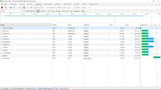
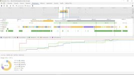

### Table of Contents
-  [Introduction](#introduction)
-  [Program specification](#Program-specification)
-  [Testing results](#Testing-results)
-  [Bug fixing](#Bug-fixing)
-  [Audit](#Audit)
-  [Competitor audit](#Competitor-audit)
-  [Competitor comparison](#Competitor-comparison)
-  [Conclusions](#Conclusions)

---

## Introduction
Todo-list-app is an application that allows to manage a list of tasks. It allows adding, updating, deleting and toggling state of each task. It has minimalistic design and basic functionality.
You can see it working here:

[https://kristoferek.github.io/todo-list-app/](https://kristoferek.github.io/todo-list-app/)

App is a kind of model showing how to implement MVC approach in JavaScript. Model, Controller, View (MVC) methodology separates data logic (model) from display functionality (View) and manages them using separate entity (Controller).

The managing part of program (Controller) is responsible for:
1.  listening to user actions from View,
2.  calling Model to perform requested operations,
3.  calling View to display results from Model  


## Program specification
You can find detailed description of all functions in [file javascript.md](./javascript.md). It was generated automatically from JavaScript files using 'documentations' script.

### **HTML** file
- **index.htm** is the only HTML file in project. It is the application entry point.

### **CSS** files
-  **index.css** - defines all application CSS styles
-  ***base.css*** - defines common styles

### **JavaScript** files
All the actions and user interactions are managed by JavaScript files.

#### MVC model
-  **app.js** creates an instance of program by initiating Model, View and Controller
-  **controller.js** initiates all user action listeners, delivers methods that connects View interactions with Model operations
-  **model.js** is responsible for data management
-  **view.js** is responsible for displaying data

#### Additional files
-  ***store.js*** delivers sample data storage solution
-  ***template.js*** delivers template function to display list items, change button states, escape characters
-  ***helpers.js*** deliver helper functions for DOM elements - querying, wrapping, delegating events  

## Testing results
I performed two staged testing: ***manual*** testing and ***automatic Jasmine*** based testing

1. During **manual testing** I found two bugs:
    -  misspelling function declaration "addItem"
    -  risky random ID generating for list elements without checking past occurrence

2. During **automatic Jasmine testing** I found a list of ready tests. I've written new test learning from existing ones. I've added or modified tests for:
    -  should show entries on start-up
    -  should show active entries
    -  should show completed entries
    -  should show the content block when todos exists
    -  should highlight "All" filter by default
    -  should toggle all todos to completed
    -  should update the view
    -  should add a new todo to the model
    -  should remove an entry from the model

During writing additional test for styling of checkbox state I found **bug**. There was  impropriate ID declaration in `<label>` selector preventing proper element styling  

## Bug fixing
I corrected following:

-  in ***controller.js***

  found

```javascript
  Controller.prototype.adddItem
```

  replaced with

```javascript
  Controller.prototype.addItem
```
-  in ***index.html***

  found

```HTML
  <input class="toggle-all" type="checkbox">
```

  replaced with

``` HTML
  <input class="toggle-all" id="toggle-all" type="checkbox">
```

- in ***store.js***

  found

```javascript
  for (var i = 0; i < 6; i++) {
    newId += charset.charAt(Math.floor(Math.random() * charset.length));
  }
```

  replaced with

```javascript
  var isUnique = false;

  while (!isUnique){
    for (var i = 0; i < 6; i++) {
      newId += charset.charAt(Math.floor(Math.random() * charset.length));
    }
    isUnique = true;
    for (var i = 0; i < todos.length; i++) {
      if (todos[i].id == newId) {
        isUnique = false;
      }
    }
  }
```

## Audit

My impression is that page loads fast, uses small amount of memory and displays content immediately. It is based only on `html`, `css` and `vanilla javascript` sources and doesn't require any media files, like images or video as well as fonts or heavy and complicated style files.

### Loading

*(The worst achieved result)*

- Transferred: **27.7 KB**
- Transfer time: **625ms**
- DOM loads: **507ms**
- Page loads in: **652ms**
- JS memory heap: **9.2 - 17.2MB**

The majority of loading time is done by JS scripting - over 50%, while rendering and painting take less then 10%.

Memory required by application to start is lower then 20MB which is more then suitable for majority of devices (even older ones).

Loading testing results are available on below listed snapshots:

[](./img/loading.jpg) | [](./img/loading_performance.jpg)
---|---
[](./img/loading_memory.jpg) | [](./img/loading_scripting.jpg)

### Operating

1. Operation of **typing in, adding and deleting two list elements**

    - scripting: **16ms**
    - rendering: **70.4ms**
    - memory usage: **+(<2)%**

  [](./img/adding_performance.jpg) [](./img/adding_memory.jpg)

2. Operation of continuously **switching three basic views** between All, Active, Completed

    - scripting: **12.2ms**
    - rendering: **32.7ms**
    - memory usage: **-(<1)%**

  [](./img/switch_performance.jpg) [](./img/switch_memory.jpg)

3. Operation of **marking one task completed**

    - scripting: **2.7ms**
    - rendering: **27.6ms**
    - memory usage: **-(<1)%**

  [](./img/marking_performance.jpg) [](./img/marking_memory.jpg)

4. Operation of **clearing three completed tasks**

    - scripting: **7.2ms**
    - rendering: **11.3ms**
    - memory usage: **-(<1)%**

  [](./img/clearing_performance.jpg) [](./img/clearing_memory.jpg)

Operating fully loaded application requires minimum recourses. During interacting with app Dev Tools shows low usage below, short scripting and rendering times.

## Competitor audit

According to the task I examined competitors webpage [todolistme.net](http://todolistme.net/). It is much more sophisticated. In addition to todo-list-app it contains following functionalities:

- subpages with instructions, contact information and development options,
- registration,
- synchronizing,
- printing,
- commercials,
- multiple lists,
- sorting,
- drag and drop reordering.


As these two apps differ a lot and **todolistme** is far more developed solution I decided to compare only basic parameters.
Here is results of basic audit for **todolistme** page.

### Loading "todolistme"

*(The worst achieved result)*

- Transferred: **1100 KB**
- Transfer time: **5340ms**
- DOM loads: **1290ms**
- Page loads in: **3360ms**
- JS memory heap: **11.4 - 74.7MB**

The majority of loading time is done by JS scripting - over 60%, while rendering and sources loading, painting take less approximately 10%. Memory required by application to start is over 74MB.

Loading testing results are available on below listed snapshots:

[](./img/c_loading.jpg) | [](./img/c_loading_performance.jpg)
---|---
[](./img/c_loading_memory.jpg) | [](./img/c_loading_scripting.jpg)


## Competitor comparison

Beneath I present the result of comparison.

&nbsp; | todo-list-app | todolistme
--|--|--
Transferred: | **27.7 KB** | **1100 KB**
Transfer time: | **625ms** | **5340ms**
DOM loads: | **507ms** | **1290ms**
Page loads in: | **652ms** | **3360ms**
JS memory heap: | **9.2 - 17.2MB** | **11.4 - 74.7MB**

### Summary

#### todolistme

***Pros (+)***

- ready to use and sophisticated solution.
- It has plenty of useful functionalities and custom design
- It uses number of well optimized images for better user experience and well optimized css
- Well supported

***Cons (-)***

- Loading time
- Memory consumption
- Overall performance strongly influenced by internal JavaScript
- Number of third party scripts requests before and after DOM loaded
- Commercial that delays loading and increases data transfer
- large number of global variables

#### todo-list-app

***Pros (+)***

- Ready to use or develop as a module
- Fast loading and operating
- Low memory consumption
- Low data transfer
- Based on MVC model easy to understand and develop
- Well commented code
- Minimalistic design

***Cons (-)***

- Limited functionality
- Still requires remote storage functionality

---

## Conclusions

App ***todo-list-app*** performs very efficient comparing to competitor. There is a space for further developments with regards of keeping app small and quick. In my opinion it would be optimal to use dedicated CSS and continuing using vanilla JavaScript .

To-do-app can be developed as a sole application as well as a very efficient module to be combined in a larger project. One of the key challenges is to chose appropriate storage solution, that will allow to maintain its biggest advantages:
* simplicity,
* speed
* low recourses demand
